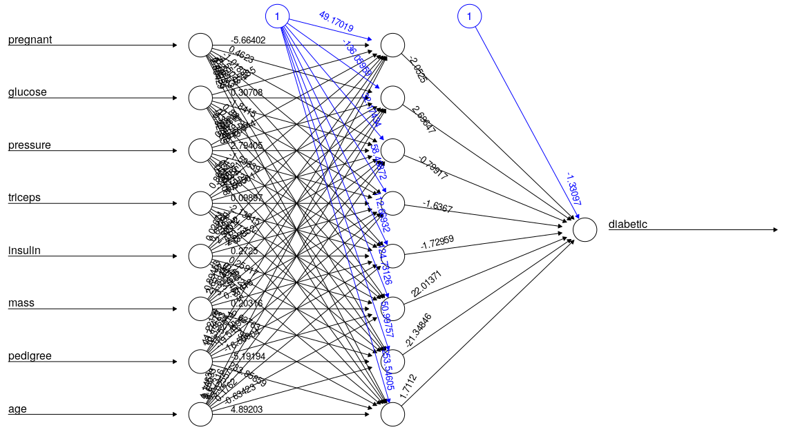

```{r setup, include=FALSE}
knitr::opts_chunk$set(echo = TRUE)
```

# 1. Executive Summary

### Background and Motivation
Diabetes mellitus is one of the major noncommunicable diseases which have great impact on human life today. Many nations are now facing a swiftly rising growth of diabetes among their residents.

According to a study by the World Health Organization (WHO), this number will have increased to 552 million by 2030, denote that one in 10 grownups will have diabetes by 2030 if no serious act is taken. In 2014, the worldwide frequency of diabetes was projected to be 9 % among adults aged 18+ years.

In developing nations, most publics with diabetes are aged between 35 and 64. The WHO already made an alarm that Diabetes is the 7th leading cause of death in the world in 2030. In 2012, an estimated 1.5 million deaths were directly attributed to diabetes. In this, more than 80 % of diabetes deaths occur in low and middleincome countries. Total deaths from diabetes are projected to rise by more than 50 % in the next 10 years.

It is apparent that diabetes is a foremost cause of blindness, amputation and kidney failure. Lack of alertness about diabetes, combined with inadequate access to health services and vital medicines, can lead to many health problems. It is a universal problem with overwhelming human, social, and economic impact, affecting around 300 million people worldwide.

By applying computational analytics on clinical big data, the massive amount of data generated in the healthcare systems will be used to create medical intelligence which will drive medical prediction and forecasting. Medical analysis is a new trend in medical science. Developing medical intelligence out of the clinical data available will create healthcare systems that are patient-centric and will reduce medical cost and hospital readmission too.

\pagebreak

### Dataset
The dataset used for the purpose of this study is the Pima Indians Diabetes Database from the National Institute of Diabetes and Digestive and Kidney Diseases. This diabetes database, donated by Vincent Sigillito, is a collection of medical diagnostic reports of 768 examples from a population living near Phoenix, Arizona, USA.

The samples consist of examples with 8 attribute values and one of the two possible outcomes, namely whether the patient tested positive for diabetes (indicated by output one) or negative (indicated by zero).

Several constraints were placed on the selection of these instances from a larger database. In particular, all patients here are females at least 21 years old of Pima Indian heritage.

* Pregnancies: Number of times pregnant
* Glucose: Plasma glucose concentration
* BloodPressure: Diastolic blood pressure (mm Hg)
* SkinThickness: Triceps skin fold thickness (mm)
* Insulin: 2-Hour serum insulin (mu U/ml)
* BMI: Body mass index (weight in kg/(height in m)^2)
* DiabetesPedigreeFunction: Diabetes pedigree function
* Age: Age (years)
* Outcome: Class variable (0 or 1)

The dataset is relatively small (23KB) and a copy can be downloaded from my GitHub repository here:

(https://github.com/gideonvos/pima/blob/master/pima-indians-diabetes.csv)

### Goal
The Pima Indians dataset has been widely studied. According to this post here on Kaggle, an accuracy rate of 75% is 
considered average, while above 78% being excellent:

(https://www.kaggle.com/general/19387)

A good comparison done in R details a comparison of Decision Tree, Logistic Regression, Random Forest and Support Vector 
Machines with the highest accuracy achieved being 76.96% using SVM.

This comparison can be reviewed here:

(https://rstudio-pubs-static.s3.amazonaws.com/346228_a62c6c91d5cf40869cd5aef7206826ae.html)

Our project goal is to score similar to the metrics quoted in this comparison, using R with the 
neuralnet package, instead of the more commonly used algorithms. Note that the model is small and 
trains very fast so a GPU-enabled or high-spec machine is not required, this code will run perfectly on a low-spec machine 
with as little as 4GB or RAM, probably even less.

I have chosen this dataset and model as I have not yet seen a good example where a neural network is used in R 
resulting in high accuracy - for this particular problem.


```{r, include=FALSE, echo=FALSE}
set.seed(42)
if(!require(tidyverse)) install.packages("tidyverse", repos = "http://cran.us.r-project.org")
if(!require(caret)) install.packages("caret", repos = "http://cran.us.r-project.org")
if(!require(neuralnet)) install.packages("neuralnet", repos = "http://cran.us.r-project.org")
if(!require(corrplot)) install.packages("corrplot", repos = "http://cran.us.r-project.org")
if(!require(gridExtra)) install.packages("gridExtra", repos = "http://cran.us.r-project.org")
if(!require(ggthemes)) install.packages("ggthemes", repos = "http://cran.us.r-project.org")

library(tidyverse)
library(caret)
library(corrplot)
library(gridExtra)
library(ggplot2)
library(ggthemes)
library(neuralnet)
library(knitr)

pima <- read.csv("pima-indians-diabetes.csv", header=FALSE)
colnames(pima)<- c("pregnant", "glucose", "pressure", "triceps", "insulin", "mass", "pedigree", "age", "diabetic")
```

\pagebreak

# 2. Methods and Analysis
## Exploratory Analysis
The exploratory analysis will hopefully show some interesting indicators, and this has been used in other models. For our neural network 
model this may or may not add value, and we'll make this decision after the analysis phase.

Let's have a quick look at the first few records. Notice the naming we used for the columns. As stated we have 8 predictor variables 
with an outcome indicator column named 'diabetic' being 1 for positive and 0 for negative.
```{r, include=TRUE, echo=FALSE}
head(pima)
```

Review a summary of the dataset.
```{r, include=TRUE, echo=FALSE}
summary(pima)
```

\pagebreak

Our goal is to predict the diabetic indicator. We can see the data is a near 50/50 split between diabetic and non-diabetic.

```{r, fig.align='center', echo=FALSE, include=TRUE, comment='', out.height = '35%'}
ggplot(pima,aes(diabetic,fill = as.factor(diabetic))) +
  geom_bar(colour="black") + 
  scale_fill_manual(values=c("light green", "light blue")) +
  guides(fill=FALSE) +
  ggtitle("Distribution of Outcome variable")
```

The dataset contains a fair distribution of age groups, most being under 30 with a second large group between 30 and 50 years of age.
```{r, fig.align='center', echo=FALSE, include=TRUE, comment='', out.height = '35%'}
pima %>%
  ggplot(aes(age)) + 
  geom_histogram(bins = 30, binwidth=0.2, color="black", show.legend = FALSE, aes(fill = cut(age, 100))) + 
  scale_x_log10() + 
  ggtitle("Age Distribution")
```

\pagebreak

Similarly we can review the BMI index with a significant grouping over 20 upwards. A high or abnormal BMI ratio is often prevalent in 
diabetes patients.
```{r, fig.align='center', echo=FALSE, include=TRUE, comment='', out.height = '35%'}
pima %>%
  ggplot(aes(mass)) + 
  geom_histogram(bins = 30, color="black", show.legend = FALSE, aes(fill = cut(mass, 30))) + 
  ggtitle("BMI Distribution")

```

Plotting the ages of the diabetic group we see a clear indicator showing more frequency at lower age groups. Correlation does not equal causation, however diabetes is often associated with lifestyle habits, even in the West, and if younger Pima people are adopting a Western lifestyle and eating habits this could explain the effect on the younger generation versus people aged over 45.

```{r, fig.align='center', echo=FALSE, include=TRUE, comment='', out.height = '35%'}

p <- pima[pima$diabetic==1,] %>%
  select(diabetic, age) %>% # select columns we need
  group_by(age) %>% # group by age
  summarise(count = n())  %>% # count per age group
  arrange(age)
p %>%
  ggplot(aes(x = age, y = count)) +
  geom_line(color="blue")
```

\pagebreak

Let's review possible correlations between being diabetic and glucose levels.

```{r, fig.align='center', echo=FALSE, include=TRUE, comment='', out.height = '35%'}
p2 <- ggplot(pima, aes(x = glucose, color = diabetic, fill = as.factor(diabetic))) +
  geom_density(alpha = 0.8) +
  theme(legend.position = "bottom") +
  scale_fill_manual(values=c("light green", "light blue")) 

p1 <- ggplot(pima, aes(x = diabetic, y = glucose,fill = as.factor(diabetic))) +
  geom_boxplot() +
  theme(legend.position = "bottom") +
  scale_fill_manual(values=c("light green", "light blue")) 

gridExtra::grid.arrange(p1, p2, ncol = 2)
```

We note a distinct correlation between being diabetic and glucose levels. Similarly, let's review any possible correlation with blood pressure. 

```{r, fig.align='center', echo=FALSE, include=TRUE, comment='', out.height = '35%'}
p2 <- ggplot(pima, aes(x = pressure, color = diabetic, fill = as.factor(diabetic))) +
  geom_density(alpha = 0.8) +
  theme(legend.position = "bottom") +
  scale_fill_manual(values=c("light green", "light blue")) 

p1 <- ggplot(pima, aes(x = diabetic, y = pressure,fill = as.factor(diabetic))) +
  geom_boxplot() +
  theme(legend.position = "bottom") +
  scale_fill_manual(values=c("light green", "light blue")) 

gridExtra::grid.arrange(p1, p2, ncol = 2)
```

We note there is no real correlation.

\pagebreak

Let's examine the other variables in more depth, such as the number of pregancies over time against age.

```{r, fig.align='center', echo=FALSE, include=TRUE, comment='', out.height = '35%'}
boxplot(pregnant ~ age, data=pima, outline = TRUE, names, plot = TRUE, 
        col= 'light blue', xlab = "Age", ylab = "Pregnancies")
```

We'll also examine BMI over time (age). This seems to remain fairly stable and we find no specific insights in either graph that directly 
indicates a link to being diabetic.

```{r, fig.align='center', echo=FALSE, include=TRUE, comment='', out.height = '35%'}
boxplot(mass ~ age, data=pima, outline = TRUE, names, plot = TRUE, 
        col= 'light green', xlab = "Age", ylab = "BMI")
```

\pagebreak

We'll further examine the data using density plots, specifically the age groups of the data samples.

```{r, fig.align='center', echo=FALSE, include=TRUE, comment='', out.height = '35%'}
g <- ggplot(pima, aes(age))
g + geom_density(aes(fill=factor(diabetic)), alpha=0.8) + 
  labs(title="Density plot", 
       subtitle="Age Grouped by Diabetic Indicator",
       x="Age",
       fill="Diabetic")
```

There appears to again be a clear correlation in the distribution of the ‘age’ variable for those that have diabetes versus those who don’t.

We also note it’s clear in the plot below that diabetic patients are associated with a higher number of pregnancies.
```{r, fig.align='center', echo=FALSE, include=TRUE, comment='', out.height = '35%'}
g <- ggplot(pima, aes(pregnant))
g + geom_density(aes(fill=factor(diabetic)), alpha=0.8) + 
  labs(title="Density plot", 
       subtitle="# Pregnancies Grouped by Diabetic Indicator",
       x="Pregnancies",
       fill="Diabetic")
```
\pagebreak

Finally, let's try to implement some “basic-level clustering”. This is not model-based clustering; rather, it is simply using 
a scatterplot and a few nice plotting parameters in ggplot2 to make some things pop right out at the viewer - again, with 
little room for ambiguity. What I like most here is the boxes that we can draw to showcase the “clusters”  a little better, 
along-with the multi-layered information, e.g., age, BMI, glucose, etc. Notice the cluster on the right, showing a clear grouping of how high BMI  correlates with being diabetic when combined with glucose levels.

```{r, fig.align='center', echo=FALSE, include=TRUE, comment='', out.height = '35%'}
d<-pima
d$age <- ifelse(d$age < 30, "<30 yrs", ">= 30 yrs")

ggplot(d, aes(x = glucose, y = mass)) +
  geom_rect(aes(linetype = "High BMI - Diabetic"), xmin = 160, ymax = 40, fill = NA, xmax = 200, 
            ymin = 25, col = "black") + 
  geom_rect(aes(linetype = "Low BMI - Not Diabetic"), xmin = 0, ymax = 25, fill = NA, xmax = 120, 
            ymin = 10, col = "black") + 
  geom_point(aes(col = factor(diabetic), shape = factor(age)), size = 3) +
  scale_color_brewer(name = "Type", palette = "Set1") +
  scale_shape(name = "Age") +
  scale_linetype_manual(values = c("High BMI - Diabetic" = "dotted", "Low BMI - Not Diabetic" = "dashed"),
                        name = "Segment") + theme_minimal()
```

We can add a correlation plot drawn between all the numerical variables to establish the linear association between each other. 
As observed in the bivariate associations, Insulin and Glucose, BMI and Skin Thickness had a moderate – high linear correlation.

```{r, fig.align='center', echo=FALSE, include=TRUE, comment='', out.height = '25%'}
corMat = cor (pima[, -9])
diag (corMat) = 0 #Remove self correlations
corrplot.mixed(corMat,tl.pos = "lt")
```

Considering we'll use a relatively simple and small neural network we might as well use all variables as-is. Exploratory analysis 
has shown some markers that can definitively be used for modelling, but since we are not medical profesionals 
with a clear understanding of the significance or importance of those variables, we'll proceed with the data as-is.

\pagebreak

## Training and Prediction
For training we will use a neural network to build a deep learning model and see if we can improve on 
what has been reported with other models. We aim to score at least 75% (low) and get to 77% (good) while above 77% is considered excellent.

We'll split our dataset into a 90/10 training/validation split. Our neural network consists of 3 layers (input, hidden, output). Our hidden layer will contain 8 neurons. The input layer receives the 8 input variables, the output layer returns the outcome as a single value. We chose 8 neurons for our hidden layer as our dataset is relatively small and simple, and this configuration has shown good results in previous studies. The final model architecture is shown below:

```{r, echo=FALSE, out.width = '80%', fig.align='center'}

```

Training the network takes between 2 and 3 minutes.

```{r, include=FALSE, echo=FALSE, cache=FALSE}

set.seed(42)
test_index <- createDataPartition(y = pima$diabetic, times = 1, p = 0.1, list = FALSE)
train <- pima[-test_index,]
validation <- pima[test_index,]

# The neuralnet package requires a string formula
n <- names(train)
f <- as.formula(paste("diabetic ~", paste(n[!n %in% "diabetic"], collapse = " + ")))

# We train our deep model using a single hidden node of 8 neurons
nn <- neuralnet(f,data=train,hidden=c(8),linear.output=FALSE, threshold = 0.06)
predicted.nn.values <- compute(nn,validation[,1:8])
```


\pagebreak

# 3. Results

We can review the confusion matrix to confirm our results.

```{r, include=FALSE, echo=FALSE, cache=FALSE}
summarization = confusionMatrix(as.factor(round(predicted.nn.values$net.result)), as.factor(validation[,9]))
```
```{r, include=TRUE, echo=FALSE, cache=FALSE}
summarization 
```

We also plot and compare the predicted rating with real rating using visualization. We note slight differences which account for the incorrect 22% 
of outcomes.
```{r, fig.align='center', echo=FALSE, include=TRUE, comment='', out.height = '30%'}
plot(validation$diabetic, predicted.nn.values$net.result, col='blue', pch=16, ylab = "predicted rating NN", xlab = "real rating")
abline(0,1)
```

Finally, let's look at our RMSE:
```{r, include=FALSE, echo=FALSE, cache=FALSE}
rmse = (sum((validation$diabetic - predicted.nn.values$net.result)^2) / nrow(validation)) ^ 0.5
```
```{r, include=TRUE, echo=FALSE, cache=FALSE}
rmse
```

\pagebreak

# 4. Conclusion
The resulting accuracy of 78% is excellent for this problem. While the neuralnet package in R is not as sophisticated as other libraries 
available such as Tensorflow and MXNet, we managed to achieve great, if not better results with just a few lines of R.

I believe we've reached our goal of demonstrating the use of neural networks in R, with good accuracy results. Various parameters can be 
adjusted in the network including initialization weights and learning rate, however we achieved good results using only the default settings.


